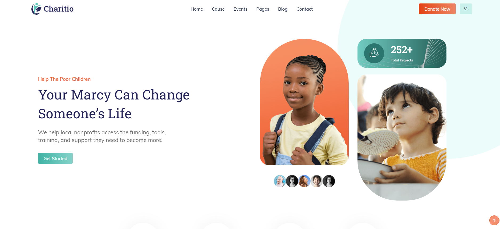
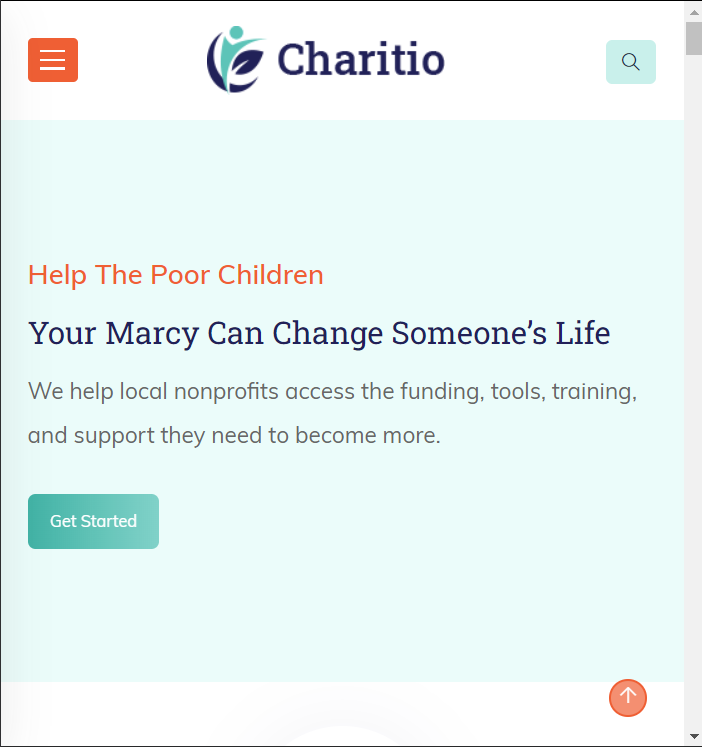

# Charity-Page

Live Site: 

## The Challenge
Your challenge is to build out this crowdfunding product page and get it looking as close to the design as possible.

### Author
- GitHub Pages: [Sara](https://github.com/Petresara)
- LinkedIn: [Sara Petreska](https://www.linkedin.com/in/sara-petreska-28bba7304/)
- Netlify 

## Technology Used
- **Front-end**
  - **React**: JavaScript library for building user interfaces.
  - **HTML**: Markup language for structuring web content.
  - **CSS**: Stylesheet language for designing the website.
  - **Netlify**: For deployment.

## Getting Started
1. **Clone the repository**
     git clone https://github.com/Petresara/Charity-Page.git
2. **Navigate into the project directory**
     cd charity-page
3. **Install the dependencies**
     npm install
4. **Start the development server**
     npm start
5. **Opwn your Browser and visit http://localhost:3000 to view the website**

## Show Your Support
   Give a ⭐️ if you like this project!

   📝 License This project is MIT licensed.